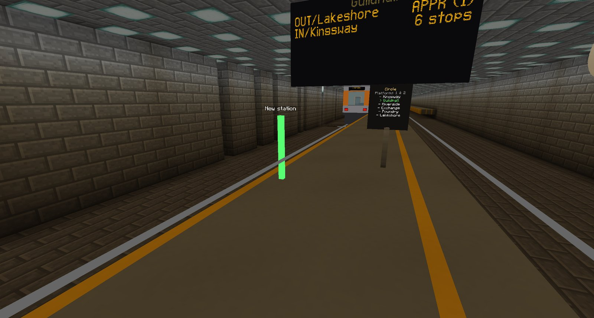
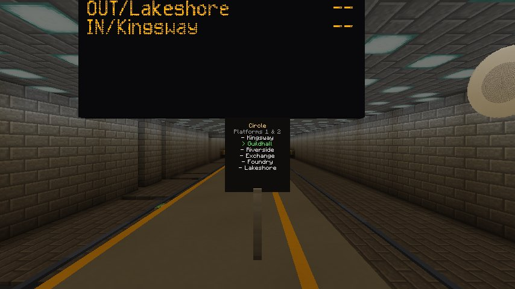
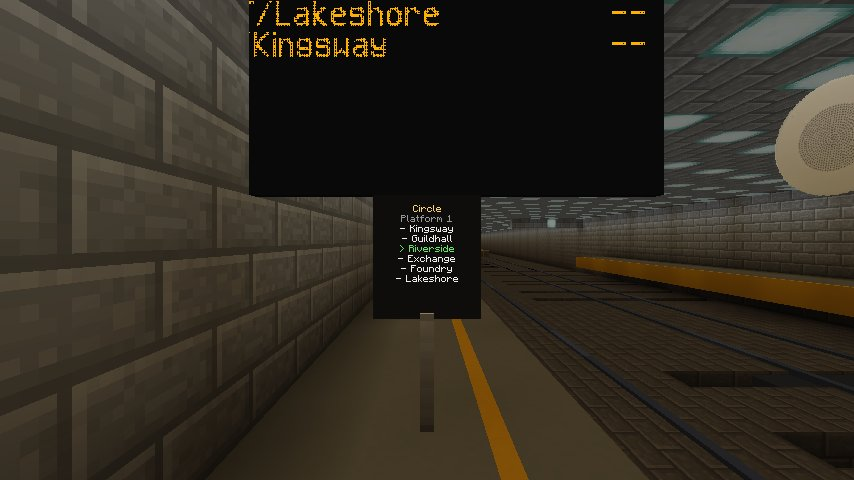

# Building a metro line

A metro is built in four stages: **lay the alignment**, **place the stations**, **assemble a
line**, then **put a train into service**. Everything after that — platforms, signage, signals,
switches — decorates or protects a system that already runs.

The fastest way to see the finished shape of it is `/rcmc metrodemo`, which does all four in one
command. This page is how to build one yourself.

---

## 1. Lay the alignment

Metro track is laid with the **same tools as coaster track** — the
[track tool or the piece builder](building-a-coaster.md). There is no separate transit track type;
what makes track "metro" is its *style* and the trains you run on it.

What differs is how you shape it. Transit alignments want:

- **Gentle radii.** Coaster curves are tight on purpose. Trains slow for every curve to keep the
  sideways push on a standing passenger to about an eighth of a g, braking for it in advance the
  way they brake for a station — so a tight curve costs time rather than comfort. A 30-block
  radius holds them to about 6 blocks/s; line speed (15) needs a radius of about 190.
- **Level platforms.** A station on a grade is buildable and will work, but a berthed train that
  wants to roll is a train fighting its own holding brake.
- **Long, shallow gradients.** Metro trains climb under traction, not momentum.

!!! tip "Hold the transit tool to see what to fix"

    While you hold the transit tool, the track every line runs on is checked and anything worth a
    look is marked on it: **curves** that slow trains below 5 blocks/s, **grades** over 6% (red over
    10%, where a train stopped facing uphill can barely start), and **platforms** on a grade over
    1.5% or a curve tighter than 150 blocks. Creating a line tells you how many there are, and
    [`/rcmc line check`](../reference/commands.md#rcmc-line) lists them with coordinates. Nothing is
    refused — they are advice.

### Give it the transit look


```
/rcmc style <sectionId> transit-catenary
/rcmc style <sectionId> transit-catenary 12      raise the wire to 12 blocks
```

or cycle styles by pointing at the track with the transit tool in **track style** mode. The styles
are covered in full in the [track styles reference](../reference/track-styles.md); briefly:

| Style | Look |
| --- | --- |
| `transit` | Wide gauge, heavy rail, ballast bed. No electrification |
| `transit-catenary` | Masts every 24 blocks, sagging messenger with droppers, contact wire |
| `transit-portal` | Two-legged gantries carrying the same wires — for multi-track alignments |
| `transit-tunnel` | Rigid conductor bar, no sag, clear of the car roof |

Style is per section, purely visual, and does not touch the spline or the physics. Electrification
is scenery: there is **no "requires power" mechanic**, and that stays the promise.

---

## 2. Place stations



Item: **`rcmc:transit_tool`**.

| Action | Effect |
| --- | --- |
| ++g++ | Cycle mode: **station → platform → line → switch → track style** |
| Right-click track | Do this mode's thing at the point aimed at |
| ++c++ | Commit what is being assembled (create the line, throw the switch) |
| ++v++ | In line mode, cycle the line kind: loop / shuttle / turnback |
| Sneak + right-click track | The mode's destructive counterpart — e.g. remove the nearest stop |
| Sneak + right-click air | Abandon what is being assembled |

While you hold the tool, a coloured post stands on the track under the crosshair, with a label
saying what a click will do there: *New station*, *Add a platform to Central*, *Stop 3: Harbour*.
Aim until the label says what you mean, then click. In line mode the stops already picked are
marked along the track with their numbers, so you can see the order you are building.

In **station** mode, right-click the track where a train should stop. That point on the spline is
the station; a train berths with its **lead car** stopped there, so leave the platform running back
from it.

!!! tip "Names come from the item's own name"

    Rename the transit tool in an anvil to `Central` and the next station you place is called
    Central. Rename it to `Orange` and the next line you create is the Orange line. 1.12.2 gives an
    item no text-entry affordance, and place-then-rename-by-command would have left the command as
    the real authoring path — the exact thing the tool exists to remove. An unnamed tool falls back
    to `Station1`, `Line1` and so on, so it works the moment you pick it up. Keep names to one word:
    commands such as `/rcmc platform` take a name as a single word.

By command instead:

```
/rcmc station <name>          create or move a station at the track nearest where you stand
/rcmc station list
/rcmc station remove <name>
```

By command it is where you **stand** that counts, not where you look: the nearest track within 16
blocks. Re-running `/rcmc station` for an existing name moves it to one fresh berth and drops any
extra platforms it had.

Station names are spoken aloud by the announcement system as text-to-speech rather than played
from baked clips, which is precisely why **arbitrary player-chosen names work**.

---

## 3. Assemble a line

Switch to **line** mode (++g++), click each stop **in order**, press ++v++ to choose whether the
line is a **loop**, a **shuttle** or a **turnback**, then ++c++ to create it.

| Kind | Behaviour at the end |
| --- | --- |
| **Loop** | Wraps round to the first stop and keeps going |
| **Shuttle** | Stops at a dead-end terminus, changes ends, and runs the pattern backwards on the same track |
| **Turnback** | Out and back on two tracks: at each terminus the train carries on round a turning loop and returns on the other track, so inbound and outbound run at the same time |

A turnback line needs the track to match: two running tracks joined by a loop at each end, and a
platform per direction at each station (an island, or a pair of side platforms). The underground
demo's Circle line is one.

By command:

```
/rcmc line create <name> <loop|shuttle|turnback> <stationA> <stationB> [...]
/rcmc line list
/rcmc line remove <name>
```

A line stores its **stations**, not its route. The route between two stops is discovered by walking
the track graph — honouring joins, switch selection, direction flips and closed-circuit wrap — so
a line does not go stale when you rebuild the track underneath it.

---

## 4. Put a train into service

```
/rcmc train [sectionId] [cars] [startSpeed] metro
/rcmc line start <lineName> <trainId> [cruiseSpeed]
/rcmc line stop <trainId>
```

Three built-in metro types, all proportioned from real stock at 1 block ≈ 1 m:

| Type | Based on | Body |
| --- | --- | --- |
| `metrocompact` | NYC A-Division / R142 | 15.65 m |
| `metro` | MBTA Orange Line, CRRC 65 ft class | ~19.8 m |
| `metrolong` | LA HR4000 / NYC 75-footers | ~22.9 m |

A server can add its own metro stock, such as a line's own colours or a longer consist, with a
JSON file. See [Train types](../reference/train-types.md).

Once in service the train drives itself: it accelerates on its traction curve, holds the cruise
speed you set, computes a constant-deceleration stopping curve to the next stop, berths, runs the
full door cycle, and departs. At a shuttle terminus it reverses. **Entering service also clears a
valleyed parked train** — taking control *is* the recovery.

### Running the line

Watching the service, the **Line Control Desk**, dwell and headway, holding and removing trains, and
keeping trains apart all have their own page: [Running a metro line](running-a-metro.md).

---

## Making a station feel like a place

### Platforms


```
/rcmc platform <station> [length] [width] [left|right|both]
```

The platform follows the spline, so it curves with the track, and it is laid at **exactly car-floor
height**. That is the entire point of it. A metro floor sits 2.0 blocks above the railheads and a
player's step height is 0.6, so without a platform you are jumping at a doorway; with one you walk
straight in, level.

It only fills air and replaceable blocks, so it completes a station rather than bulldozing one. A
train stops with its lead car at the stop point, so the platform runs *back* along the train rather
than from its nose: three-quarters of its length behind the stop point, a quarter ahead. It is laid
at the station's **first berth** only; the far side of an island is decked by hand.

!!! note "Why the car floor is a whole block"

    Block tops are integers. At any fractional floor height, a platform can only ever land part of
    a block off the car floor — inside a player's step, so boarding works, but never flush. At 2.0
    the platform surface and the saloon floor are exactly level. This is why the underframe was
    raised a full block rather than a half.

Two blocks are involved: `rcmc:platform` decking, and `rcmc:platform_edge`, which carries the
tactile warning strip and a facing that points at the track.

### The platform decides which doors open

**Where you put the platform is how the train knows which side to open.** Placing a station, or
laying a platform, looks either side of the track and records what it finds — so a platform on one
side gives you doors on one side, and platforms on both give you both. Nothing extra to author.

What counts is a shape, not a block: a surface at car-floor height with two blocks clear above it,
which is to say somewhere a passenger could stand. The two blocks above are what tell a platform
apart from the tunnel wall running past at the same height. So a platform you built by hand out of
quartz, slabs or concrete is read exactly like one laid from `rcmc:platform`.

Override it when you need to:

```
/rcmc station doors <name> [platform] <left|right|both|auto>
```

Useful for an island platform you only want served on one side. `auto` re-runs the detection.

### Island platforms: one station, two berths

A station is a *place*, and a place can have more than one track through it. An island platform —
decking with a running line down each side — is one station with two **platforms**, one per track.

In **platform** mode (++g++), right-click the *other* track at a station and it gains a berth there;
sneak+click a berth to remove it. As with stations, the tool's own name becomes the berth's label,
so renaming it to `Outbound` in an anvil labels the next one. By command:

```
/rcmc station Central                       the first berth, at the track you are standing by
/rcmc station platform Central add Outbound  now stand beside the other track
```

The tool finds "this station" by **world distance**, not along the rails — the far side of an island
can be hundreds of blocks away by track while being six blocks away across the decking, and it is
obviously the same station to anyone standing on it.

Each berth keeps its own door side, because the two tracks look out at the same decking from
opposite hands: what is *left* to an inbound train is *right* to an outbound one. You do not have to
work that out — a train berths at whichever platform it can reach on the track it is running on, and
opens that platform's side.

Until the second berth exists, only one track is a station at all. That is why an arrival board at
an island shows one direction and leaves the other blank: there is nothing on the other side for it
to resolve. Add the second berth and the board fills both — which is the point of the exercise.

Once a station has more than one berth and the berths are labelled, a board also puts the platform
in brackets against a train that is **due here** — `BRD (1)`, `APPR (2)`: boarding and
approaching, abbreviated the way real boards abbreviate them so the destination keeps the room. It
appears only on those rows, and deliberately: a train still stops away has picked its platform at the
station it is running to, not at this one, so a number against it would send you to the wrong side
of the island on the strength of somebody else's platform.

Further out, a board shows **minutes**. They are not predicted from speeds: each line learns how long
its trains actually take from stop to stop — dwell, hills, signals and headway holds included — and
the board adds up the legs between a train and this station. A freshly built line has not been timed
yet, so its boards count stops until its trains have run each leg once; after a reload they relearn
within a lap.

Riders get told. As a train runs into a station it announces **"Entering Harbor. The doors will open
on the left."** — a few seconds before it berths, so there is time to cross the car and be at the
right door when it opens. A rider can only walk out through a door that actually opened.

### Signage


| Block | What it shows |
| --- | --- |
| `rcmc:station_sign` | Post-mounted line map: the linked line's stops in order, with a "you are here" marker. Right-click cycles lines at an interchange |
| `rcmc:arrival_board` | Ceiling-hung amber-on-black board: per-direction rows reading minutes (`3 min`) — or `1 stop` / `N stops` until the line has been timed — `APPR` when this station is the train's next stop, and `BRD` while it is berthed here. Hang it under a ceiling with **5 blocks of clearance across and 2 down** — the panel is physically the size it looks |
| `rcmc:station_speaker` | Wall- or ceiling-mounted PA that announces approaching trains |

All three **auto-link to the nearest station** when placed, and store only that station's *name*.
Every frame resolves against the live registry, so a sign can never go stale — rename or move a
station and the signs follow.

<div class="grid" markdown>





</div>

A line-map sign at a station with more than one platform names the platform it stands at: both, on an
island between two tracks.

The trains carry signs of their own, driven by the same live service data, and blank on a car
that is not in service:

- **Inside each car**, a sign under the ceiling at both ends reads **`Next stop: X`** while running
  and **`Now at: X`** while berthed, with the line, direction and destination beneath —
  `Green  OUT/South`. Text too long for the panel scrolls.
- **Outside**, each side of the car carries an amber destination sign showing the terminus in
  capitals, `SOUTH`, so you can read where a train is going from the platform. A loop line has no
  terminus, so it shows the line's name instead. The same sign sits above the windscreen at each
  end of the train, where you read it as the train runs in.

Arrivals are shown in **minutes** once the line has timed the trip: each train learns how long each
leg between stations takes, and the board counts down from that. Until a leg has been timed, the
board shows how many **stops away** the train is instead. A train pulling in shows `APPR`, and
one at the platform shows `BRD`.

### Cabs and lamps

Each end of a train is a driving cab: a driver's desk and seat behind the windscreen, closed off
from the saloon by a partition with a cab door. Passengers don't sit or stand in the cab.

The end a train is leading with shows **white headlamps**, and the other end shows **red tail
lamps**. At a terminus the lamps swap as soon as the train is due to reverse, while it is still at
the platform, so the lamps tell you which way it will leave. A train out of service shows lamps for
the way it is moving, and keeps them when it stops.

### Announcements

Trains speak, and every announcement is preceded by a chime:

- **In-car**, heard by riders and anyone within about 24 blocks: *"Next stop: X"* shortly after
  departure, and *"This is X"* as the doors open on arrival. A single ding precedes each.
- **On the platform**, from a station speaker: an approaching-train announcement, preceded by a
  brighter ding.

Speech uses CSM's text-to-speech when that mod is present (soft-detected — RCMC does not require
it), and falls back to an on-screen subtitle otherwise.

!!! info "Every sound in the mod is synthesised from scratch"

    Door chime, door close, brake release and both announcement chimes are generated by
    `tools/audio/synth_metro_sounds.py` and checked in alongside the audio, so the provenance of
    every sound file stays inspectable. Real recordings were *measured* for their frequencies and
    envelopes, never used. **Do not replace these with sampled audio.**

---

## Switches and junctions

A line is a line; a **network** needs switches. In **switch** mode on the transit tool: click the
**throat** end, then each **branch** end, then ++c++. A switch needs at least two branches.

```
/rcmc switch create <throatSection> <start|end> <branchSection> <start|end> <branchSection> <start|end> [...]
/rcmc switch list
/rcmc switch throw <throatSection> <start|end> [branchIndex]     no index = cycle to the next
/rcmc switch remove <throatSection> <start|end>
```

A switch is a throat leading to a *choice*, with selection state — deliberately a different concept
from a plain join between two ends. **Trailing moves against the points dead-end**, which is both
safe and honest: a train arriving from the wrong branch stops rather than teleporting through the
blades.

---

## Running more than one train

Trains never run into each other: each stops short of the train ahead. To space several trains out
properly, give the line **signals**, placed with the Transit Builder's signal mode. See
[Signals](running-a-metro.md#signals).

---

## Known gaps

See [Troubleshooting](../help/troubleshooting.md#known-gaps).
