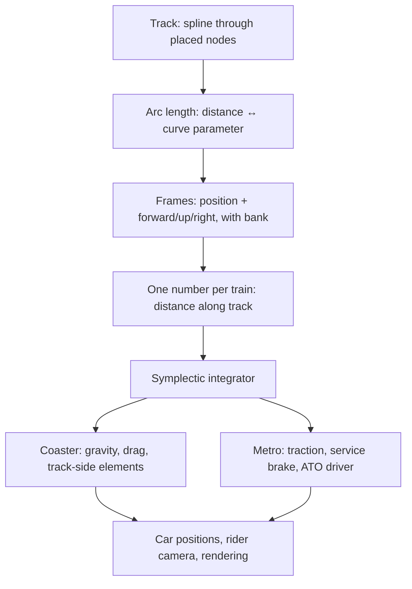

# Coasters vs metro

RCMC has two ride families. They are not two mods bolted together, and the metro is not a
retextured coaster. They run on **the same track, the same arc-length parameterisation and the
same integrator** — the difference is entirely in what pushes the train and what decides where it
should be.

## The shared core

Everything above the split is identical. A metro train has one degree of freedom exactly as a
coaster train does — a *powered* train is that same scalar with a different force on it.

## What differs

| | Rollercoaster | Metro / transit |
| --- | --- | --- |
| **What moves it** | Gravity, plus track-side elements it passes over | Motors it carries, under an automatic driver |
| **Force model** | Track-side spans (`ChainLift`, `BrakeRun`, `StationPlatform`, drive tyres) | Per-train controller: traction curve, service brake, jerk limiter |
| **Who decides speed** | The layout. You design potential energy and let it go | The ATO driver, targeting the lowest of line speed, the curve limits ahead, and a braking curve to the next stop, signal or train |
| **Stopping** | A brake run, at a fixed place on the track | A computed stopping curve to wherever the next stop happens to be |
| **Route** | The circuit. It goes round | A line: an ordered list of stations, walked as a route, with terminus turnback |
| **Signalling** | Fixed block sections, exclusive occupancy, stop at the block brake | Movement authority (ATO/ATP style) — distance to the nearest occupied block, fed into the same braking law |
| **Stations** | Dwell, then dispatch | Full service cycle: approach, doors open, board, doors close, depart |
| **Doors** | None | Real sliding leaves; boarding is gated on them being open |
| **Riding** | Seated, camera locked to the car including roll | Seated *or standing* — you can walk around inside a moving car |
| **Rating** | Excitement / intensity / nausea, from a simulated run | None. Those are coaster concepts; a punctuality metric would be a different number measuring a different thing |
| **Typical speed** | Whatever the drop gives you | A cruise speed you set, held by the driver, and eased for curves |
| **Build tool** | [Track tool](building-a-coaster.md#the-track-tool-freeform) or [piece builder](building-a-coaster.md#the-piece-builder-prefabs) | [Transit tool](building-a-metro.md), on track laid with either coaster tool |
| **Track style** | `coaster` (the default look) | `transit`, `transit-catenary`, `transit-portal`, `transit-tunnel` — wider gauge, heavier rail, ballast, electrification |

## Which do I want?

**Build a coaster** if the point is the ride: drops, airtime, inversions, and a number at the end
telling you whether what you built is thrilling or lethal. You design the shape and gravity does
the rest.

**Build a metro** if the point is the network: getting from A to B on a schedule, with stations
that feel like places, trains that drive themselves, doors that open, boards that tell you how
many stops away the next service is, and announcements that name your stations out loud.

They coexist in one world without interfering. Track style is per-section, so an electrified
metro alignment and a bare coaster circuit can sit side by side; physics is per-train, so what a
train does is decided by what kind of train it is, not by where it is.

## What they deliberately do **not** share

The hoped-for unification — one general "traction/brake element" serving the coaster's lift hill,
launch and brake run *and* the metro's motors — was tried and rejected. A metro carries its motors
with it, so its force model is a property of the train; a coaster's lift hill is a property of the
track. They never shared a base class to begin with.

Two things *are* duplicated on purpose: the deadbeat control law and the constant-deceleration
stopping curve. Collapsing them would couple two families whose clamps genuinely differ — a metro
driver's are asymmetric (traction up, service brake down), while a coaster brake may only ever
remove energy. The duplication is cheaper than the coupling.

## Non-goals, for both families

- **No park-management economy.** Guests, ticket pricing, staff and park rating belong in a
  companion mod, if ever. RCMC ships the RCT-style *ratings*, not the sim around them.
- **No freight.** No cargo logistics, no couplers-and-shunting gameplay, no fuel systems, no
  cross-mod item transport. If it isn't a passenger riding a spline-guided train, it's out.
- **No vanilla rail compatibility.** Different domain, different physics.
