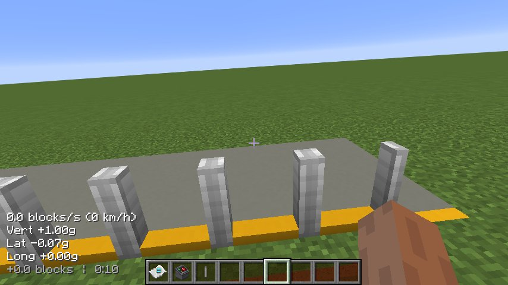
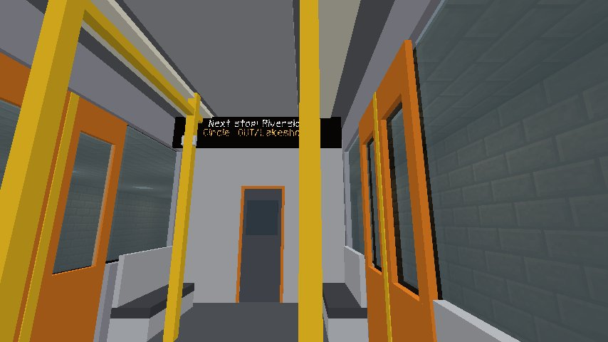
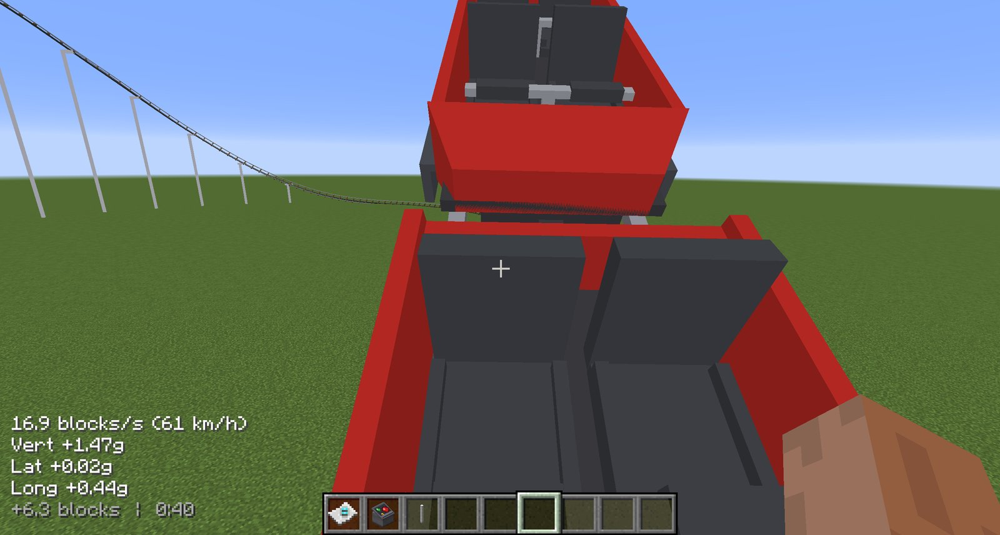

# Riding

## Boarding a coaster

A coaster is boarded **in its station, while the train is stopped there**. **Right-click a car** and you
take the next free seat, front row first; every car seats two abreast in each row.

**Air gates** stand along the platform edge. They open while a train is loading, start to close shortly
before it leaves (or when the operator presses DISPATCH), and the train doesn't move until they have
been shut a moment.

**Getting off:** once the train is back in the station, **sneak** (++shift++) and you step out beside
your seat onto the platform. Anywhere else, the restraints hold you in: sneaking puts you straight back
in your seat.

When you can't board, the ride says why:

- the ride is **closed**, **testing** or **emergency-stopped**;
- the train is not **in its station** and stopped there.

The one time you can get off out on the course is an **evacuation**: if the ride has been
emergency-stopped or closed, riders of a train stopped out on the circuit may climb out where it
stands. Track with no station on it at all is a sandbox run, and you can board and get off anywhere.

## Boarding a metro train

A metro train is boarded by **walking in**. While a train is stopped at a platform with its doors open,
walk through a doorway, exactly as you would in real life. Inside, you can walk around the car while it
runs.

**Getting off:** walk out through an open door at a station. You're placed on the platform beside the
door you used. The doorways are real openings, so walking into the wall between them stops you.

**Only the platform side opens.** The train announces it as it pulls in (*"Entering Harbor. The doors
will open on the left."*), with enough warning to cross the car first.

**Inside each car**, a sign at each end reads **`Next stop: X`** while the train runs and **`Now at: X`**
while it's stopped at a station, with the line, direction and destination underneath. A train in
service won't let you board with its doors shut, and says so.

### Walking around inside

Standing and walking in a moving car works because you're really riding it: the game moves you with
the car, and the walls and seats keep you inside it. A few things follow from that:

- You board where you walked in, not in an assigned seat.
- **You can't step off a moving train.** With the doors shut and the train moving, trying to get off
  just puts you back aboard. With the doors open, you leave by walking out through one.
- In multiplayer, other players inside a moving car appear standing where they boarded. Their own game
  shows them correctly; this is a known limitation.

## The camera

When riding a coaster, your camera is locked to the car: it turns, pitches **and rolls** with it. Roll
is what makes a banked turn feel banked and an inversion feel like an inversion. You can still look
around a little.

If you'd rather the world stayed level, turn off camera roll with the client setting
`enableCameraRoll`: see [Configuration](../reference/config.md#client).

## The ride HUD

While you ride, the HUD in the corner shows:

- your **speed**, in blocks per second and km/h;
- the **G-forces** in all three directions: **Vert** (up and down), **Lat** (sideways) and **Long**
  (forwards and back);
- your **height** and the **ride time**.

**Vertical G** is the one to watch. Around 1 g is normal. Below zero is **airtime**, the floating
feeling coaster fans chase. High positive G pushes you into your seat; too much for too long is what
makes a ride intense instead of fun. Turn the HUD off with `enableRideHud`.

### G-force effects

What the ride does to you also shows on screen. All of it can be adjusted or turned off in the
[client config](../reference/config.md#client):

| Effect | When | Settings |
| --- | --- | --- |
| **Greyout** (tunnel vision) | Above about 4.5 g | `grayOutThresholdG`, `grayOutRangeG` |
| **Redout** | Sustained below −2 g | `redOutThresholdG`, `redOutRangeG` |
| **Field-of-view kick** | Launches and hard braking | `enableGForceFovKick`, `fovKickDegreesPerG`, `fovKickMaxDegrees` |

The values are smoothed over a short time (`gForceSmoothingSeconds`), so a single jolt doesn't flash
the screen.

## Sounds

A coaster train sounds the way it moves. Everything follows its speed, so a faster train rolls louder
and higher.

| Sound | When you hear it |
| --- | --- |
| Rolling | Whenever the train moves; carries about 40 blocks at speed |
| Chain lift | While the train climbs a lift: the clack of the anti-rollback |
| Brakes | While a brake run is actually slowing the train, including the station's brakes |
| Drive tyres | While tyres are pushing the train |
| Launch | Once, as a launch fires |
| Dispatch | A hiss of air as the station's brakes release the train |
| Air gates | The gates clanking open and shut |
| Wind | Riders only, once the train passes about 5 blocks/s |

Riders hear their own train from inside it; everyone else hears it from where it is. Coaster sounds
follow Minecraft's **Blocks** volume slider, and `coasterSoundVolume` in the
[client config](../reference/config.md#client) scales or silences them.

Metro trains have their own sounds: a door chime before the doors close, the doors themselves, the
brakes releasing as they leave, and **announcements** with a chime: *"Next stop: X"* after leaving a
station and *"This is X"* on arrival. Station speakers announce approaching trains. If
**City Super Mod** is installed, announcements are spoken aloud; otherwise they appear as subtitles.

## Standing on the track

Trains are solid, and a moving one is dangerous. A standing train blocks you along its whole length. A
moving train throws anyone it hits clear of the track, players and mobs alike, and hurts them according
to its speed: a train creeping in at walking pace only pushes you aside, a lift hurts, and a coaster at
speed kills (*was hit by a train*). A train's own riders are never hit.

Server owners can scale the damage, or turn it off and keep just the push, with
[`trainDamageMultiplier`](../reference/config.md#gameplay).
