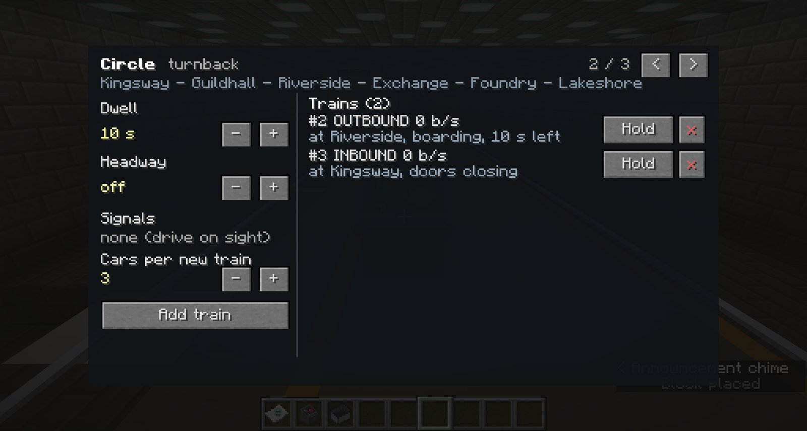
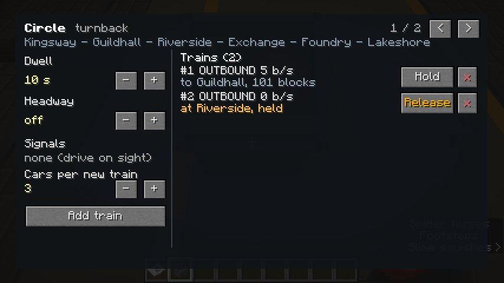
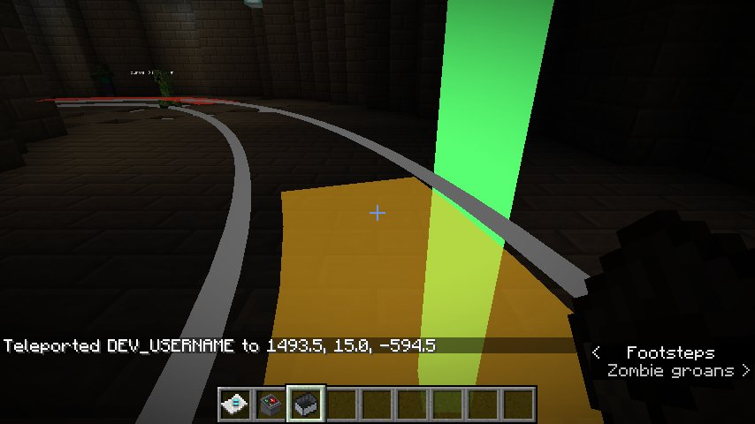

# Running a metro line

Once a line exists ([Building a metro line](building-a-metro.md)), trains on it drive themselves. This
page is about the service: putting trains on, watching them, holding and removing them, setting how
long they wait at stations, and keeping several trains apart.

## Putting a train into service

```
/rcmc train <sectionId> [cars] 0 metro
/rcmc line start <lineName> <trainId> [cruiseSpeed]
```

The first spawns a metro train on the track. There are three built-in metro trains, all built to real
proportions:

| Type | Based on | Car length |
| --- | --- | --- |
| `metrocompact` | NYC A-Division / R142 | 15.65 m |
| `metro` | MBTA Orange Line, CRRC 65 ft class | about 19.8 m |
| `metrolong` | LA HR4000 / NYC 75-footers | about 22.9 m |

A server can add its own, with its own colours or lengths: see [Train types](../reference/train-types.md).

The second puts the train **into service** on a line. It then drives itself, at 15 blocks/s unless you
give another cruise speed:

- it speeds up along its traction curve and holds line speed;
- it **slows for curves**, braking in advance, so riders aren't thrown sideways;
- it brakes smoothly to a stop at each station, lined up with the platform;
- it opens its doors on the platform side, waits, closes them, and leaves;
- at the end of a **shuttle** line it reverses and heads back. On a **turnback** line it carries on round
  the turning loop onto the other track, and never reverses.

Starting a service also recovers a train that had stalled. And a train started facing the wrong way on
a line is turned round to run with the others.

## The Line Control Desk

The easiest way to run a line. Place a **Line Control Desk** (`rcmc:line_desk`) anywhere and
right-click it.



| Control | What it does |
| --- | --- |
| **< >** | Step through the lines. The desk runs **every** line, and opens on the one serving the station nearest it |
| **Dwell − +** | How long trains wait at each station with their doors open, in 5-second steps |
| **Headway − +** | The least time between two trains leaving the same platform in the same direction, in 30-second steps, or **off** |
| **Signals** | How many signal blocks the line has, or *none (drive on sight)* |
| **Cars per new train** | The length of the next train added |
| **Add train** | Puts a new train at the first clear platform of the line, already in service |
| **Hold / Release** | Holds a train at its next station, doors open, until you release it |
| **x** | Takes the train off the track |

Each train's row shows its **direction**, **speed**, and what it is doing: *to Guildhall, 40 blocks*,
*at Riverside, boarding, 6 s left*, *at Riverside, held*. If it's waiting out on the line, the row says
which train it is stopping for.



## Watching the service from chat

```
/rcmc line trains [lineName]
```

lists every train in service, or every one on a line, with its direction, where it's heading, its
speed, and anything holding it up:

- ***stopping for train #N ahead***: it's waiting behind another train. Often that's a train left
  parked on the track: remove it with `/rcmc train remove <id>`, or put it into service.
- ***HEAD-ON with train #N***, in red: two trains are running **at each other** on the same track, and
  will stand nose to nose for ever. Take one out with `/rcmc line stop <id>` and restart it facing the
  other way. `/rcmc line start` warns when it would put a train in that position.

## Dwell and headway

```
/rcmc line set <lineName> dwell <seconds>
/rcmc line set <lineName> headway <seconds|off>
```

**Dwell** is how long the doors stay open at each stop. The default is 10 seconds.

**Headway** is the least time between two trains leaving the same platform in the same direction. With
a headway set, a train that has caught up with the one ahead keeps its doors open until the gap has
grown again. That stops a line **bunching**, where a late train picks up more passengers, runs later
still, and ends up nose to tail with the one behind it. A good headway is a little under the time for
a full trip divided by the number of trains.

Both are saved with the line, can be undone like any edit, and reach trains already running at their
next stop.

## Holding and removing trains

```
/rcmc line hold <trainId>
/rcmc line release <trainId>
/rcmc line stop <trainId>
/rcmc train remove <trainId>
```

- **Hold** keeps a train at its next station, doors open, until it's released. Holds are **not saved**:
  a restart releases them.
- **Stop** takes a train out of service. It brakes to a stop where it is and stays there, parked.
- **Remove** takes it off the track altogether.

## Keeping trains apart

**Trains never run into each other.** With or without signals, every train in service stops **5 blocks
short** of any train ahead of it, whether that train is on its line or not, in service or parked, and
goes on when the way clears. A train standing at a platform holds its brakes, so it doesn't roll even
on a slope.

That keeps trains from colliding, but not from **bunching**: without signals, a follower closes right
up behind the train in front and waits behind it at every stop. **Signals** are what space trains out.

### Signals

Signals divide a line's track into **blocks**. A train may only run as far as the next block boundary
before a block another train is in, and brakes to stop there, the same way it brakes for a station. It
proceeds as soon as the block ahead clears.

**Place signals with the Transit Builder.** Press ++g++ until the mode is **Signal**, then right-click
the track where a signal should go: the block it lands in is split in two. Sneak-right-click near a
signal to remove it. While you're in signal mode, every signal is marked with a red post. The tool
warns you when a block is shorter than the trains using it, or when a signal stands inside a platform,
where a train held at it would be half in the station. Signals usually go just before a platform.

A signal applies to every line that stops on that track.

**Or divide a line evenly by command:**

```
/rcmc line signals <lineName> <count|off>
```

That cuts every section the line's stations sit on into equal blocks. It's a quick start, but the
boundaries fall wherever the arithmetic puts them, including in the middle of a platform, so placing
them by hand is better.

As with coasters, blocks must be longer than the trains, and a line with as many trains as blocks can
deadlock.

## Curves and speed

A train slows for every curve to keep the sideways push on standing passengers to about an eighth of a
g. It works out the limit for each curve ahead from its radius and brakes early enough to be at that
speed as it enters, so a tight curve costs journey time, not comfort.

| Curve radius | Speed through it |
| --- | --- |
| 190 blocks or more | Full line speed, 15 blocks/s |
| 50 blocks | about 7.7 blocks/s |
| 30 blocks | about 6 blocks/s |
| 10 blocks | about 3.5 blocks/s |

## Checking a line

```
/rcmc line check [lineName]
```

lists anything on the line's track worth a look, with coordinates:

- **curves** that slow trains below 5 blocks/s (red below 3);
- **grades** steeper than 6%, and red over 10%, where a train stopped facing uphill can barely start;
- **platforms** on a grade over 1.5%, or on a curve tighter than 150 blocks, which leaves a gap between
  the train and the platform edge.

The same checks are drawn on the track while you hold the Transit Builder, amber and red:



Creating a line with the Transit Builder tells you how many it has. Nothing is refused: they're advice.

## When nobody is online

**Trains pause when nobody is online.** Nothing moves at all: a train keeps its exact position and speed,
a dwell keeps its remaining time, and a service stays in service. When someone joins, everything carries
on as though no time had passed. One player anywhere on the server keeps the Overworld's lines running.

**A train in unloaded chunks keeps running.** It doesn't need the world to be loaded around it, only the
track. Its cars reappear within a second once the area loads again.
