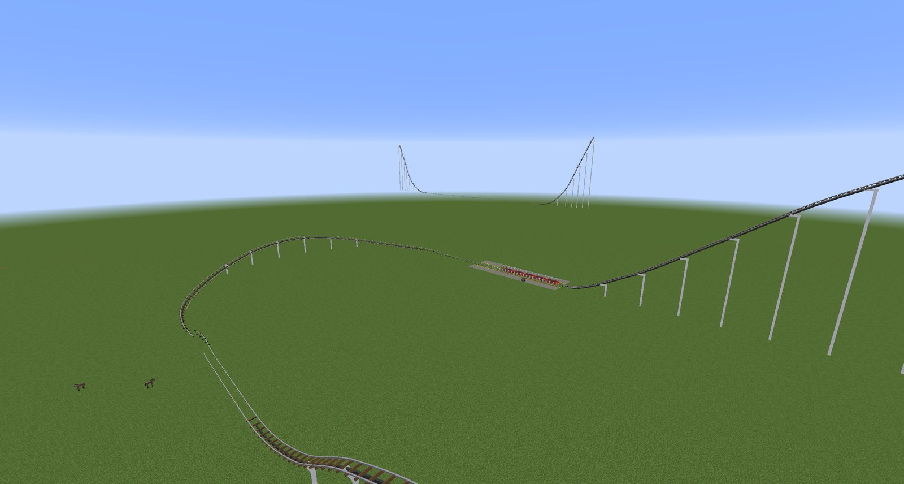
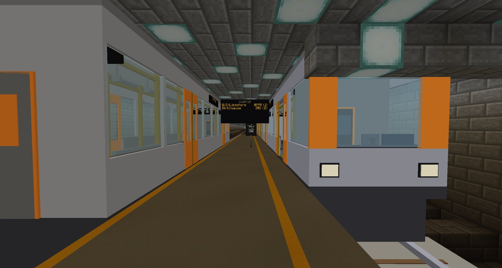

# RCMC — Rails & Coasters: Minecraft

A **Minecraft 1.12.2 Forge** mod for building real rides: roller coasters and metro lines on
smooth, curving track, with trains that are simulated properly and that you can ride.

Track here is not a line of blocks. It is a smooth curve through points you place, so it can bank,
twist, loop and climb at any angle. The trains that run on it have real momentum: a coaster climbs
its lift, trades height for speed down the drop, feels every hill and is slowed by its brakes, and
a metro train accelerates, slows for curves, stops at stations and opens its doors.

-   :material-rollerblade: **Roller coasters**

    ---

    Lift hills, launches, drops, airtime hills, banked turns, loops and inversions, brake runs,
    stations with gates, several trains at once, and an excitement / intensity / nausea rating for
    everything you build.

    [:octicons-arrow-right-24: Your first coaster](start/first-coaster.md)

-   :material-subway-variant: **Metro and rail transit**

    ---

    Self-driving trains with doors, platforms, stations, lines, signals, arrival boards, line-map
    signs and spoken announcements, and a control desk to run the service.

    [:octicons-arrow-right-24: Your first metro line](start/first-metro.md)

## New here? Start with these

1. **[Install RCMC](start/installing.md)**: it's in the Alto_EXPERIMENTAL pack, or you can add
   the jar to any Forge 1.12.2 setup.
2. **[Try the demos](start/demos.md)**: one command builds a complete, working coaster or metro
   network in front of you. It's the fastest way to see what the mod does.
3. **Build your own**, following the step-by-step guides to
   **[your first coaster](start/first-coaster.md)** and **[your first metro line](start/first-metro.md)**.

When you want the details, **[Coasters vs metro](guide/coasters-vs-metro.md)** explains how the
two families differ, the **Coasters** and **Metro** sections cover every tool and setting, and
**[Reference](reference/commands.md)** lists every command, block and option.

!!! info "RCMC is new, and this is its first public release"

    The first full release, 2026.09.23, is being tried out in the **Alto_EXPERIMENTAL** pack
    before a wider rollout. Expect some rough edges. If something breaks or feels wrong, the
    [troubleshooting](help/troubleshooting.md) page covers the common problems, and reports are
    very welcome on [GitHub](https://github.com/Mica-Technologies/RCMC/issues).

## How it differs from minecarts

| | Vanilla minecarts / Railcraft | RCMC |
| --- | --- | --- |
| **Track** | Block by block, straight or at 45° | Smooth curves in any direction, through points you place |
| **Banking** | None | Track tilts into turns, and rolls through inversions |
| **Motion** | Hops from block to block | Continuous movement along the curve |
| **Physics** | Fixed speed with a push | Real momentum: gravity, drag, lifts, launches and brakes |
| **Riding** | Sit in a cart | The camera leans and rolls with the car, and you can walk around inside a moving metro |
| **Trains** | One cart | Multi-car trains, coupled together |

## Contributing to this wiki

Every page is a Markdown file under
[`docs/`](https://github.com/Mica-Technologies/RCMC/tree/main/docs) in the mod's repository, so a
correction is an ordinary pull request, and the site rebuilds itself when it is merged. The
:material-pencil: icon at the top of each page opens it on GitHub.
