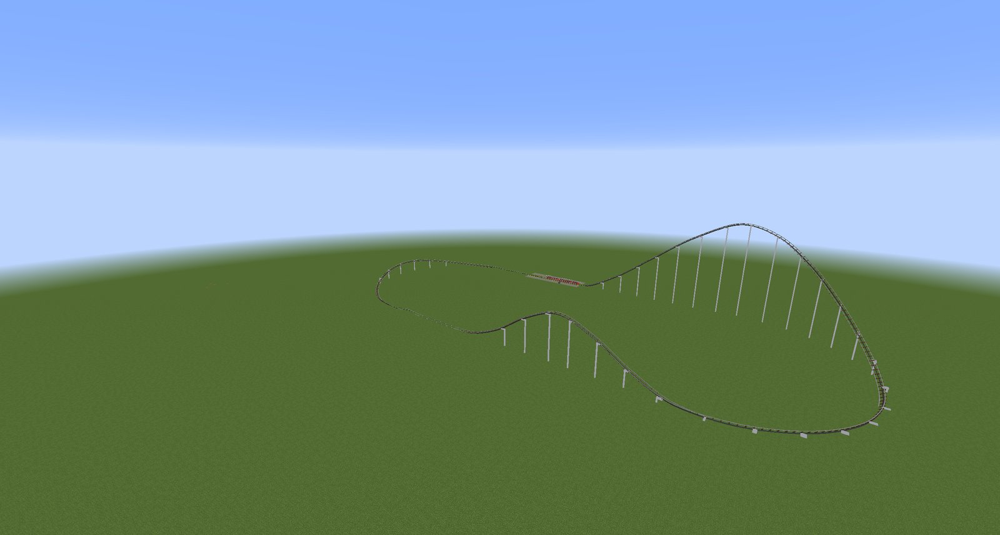
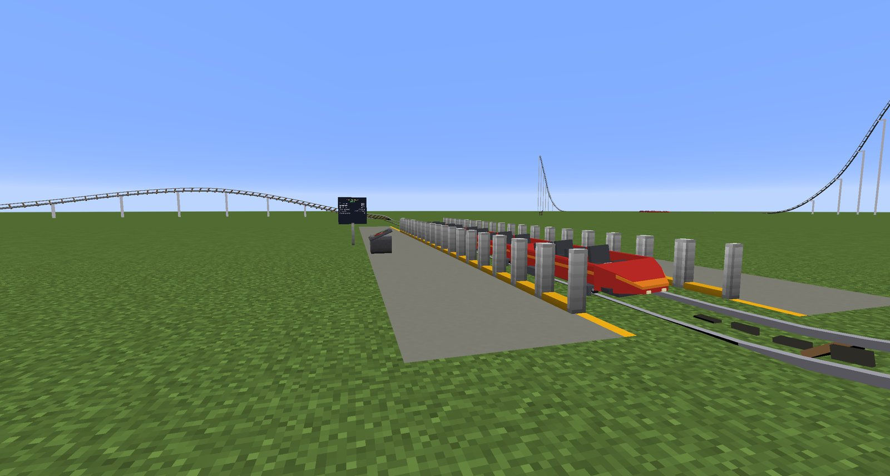
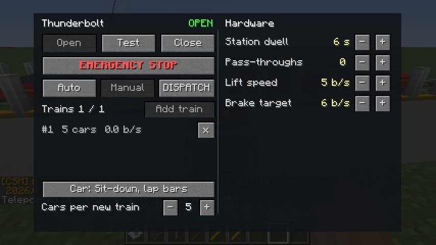
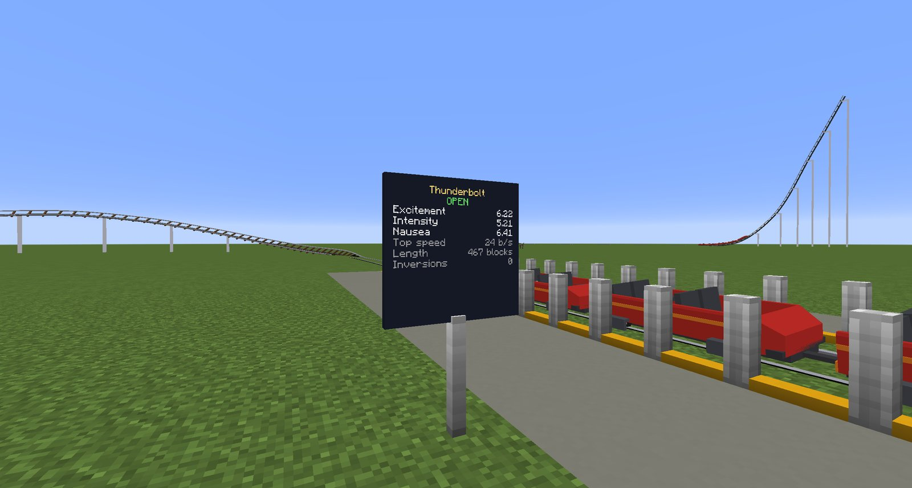
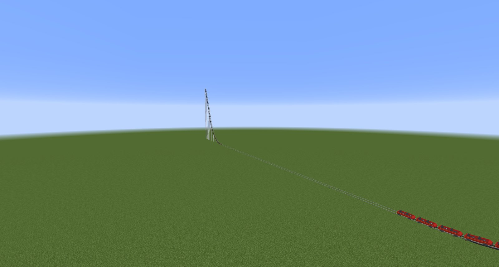
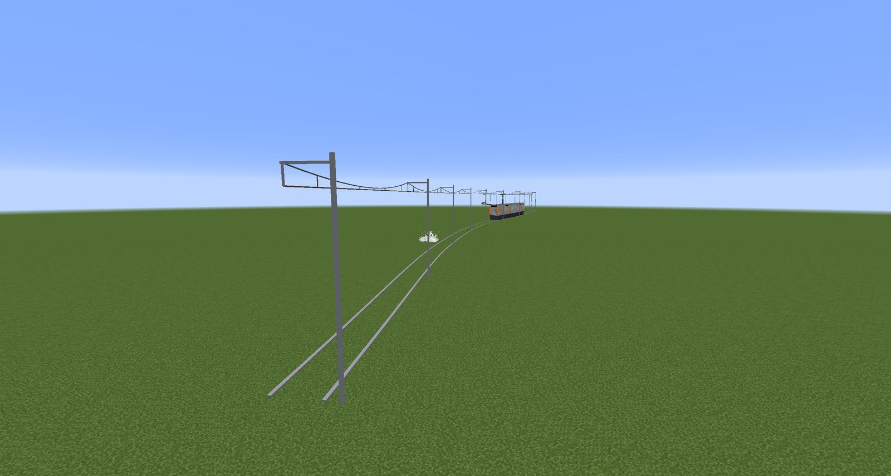
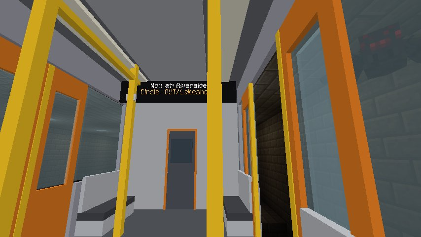
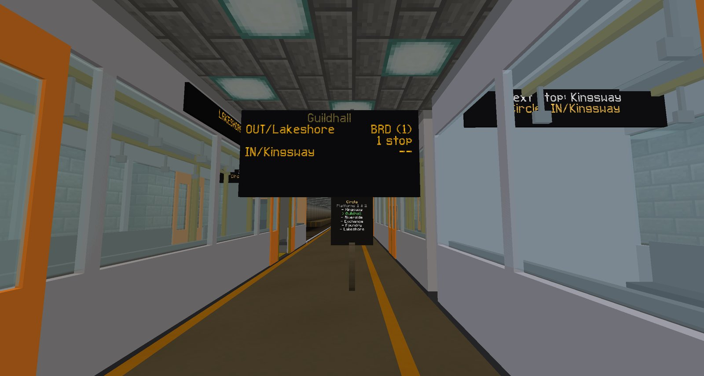

# Try the demos

The quickest way to see RCMC is to let it build something for you. Each demo command lays out a
complete, working ride in front of you: track, supports, stations, platforms and signs, ready for a
train. This page walks through each one and what to try once it's built.

## Before you start

- Use a **creative world with cheats on**. The demos are built with the `/rcmc` command, which
  needs operator permission. A **superflat** world is ideal: nothing is in the way, and everything
  is easy to see.
- The demos need room. The coaster covers about 150 × 120 blocks and its lift is 34 blocks tall.
  The underground metro network is over 700 blocks long.
- Stand where you want the ride and run the command. The coaster's **station platform is built at
  your feet**, and the metro network starts where you stand.
- Optional, but it makes for a calmer test world:

    ```
    /gamerule doDaylightCycle false
    /time set day
    /gamerule doMobSpawning false
    ```

Every demo tells you in chat what it built, the **id** it gave the track (coasters and metro lines
are numbered from 1 in a fresh world), and the exact command to run next. You never have to guess
an id.

---

## The demo coaster

```
/rcmc demo
```



A complete sit-down coaster, 467 blocks long:

1. a **station** with a platform, and **air gates** along the edge where the train stops;
2. a **chain lift** 34 blocks up;
3. a **first drop** that curves round the far end;
4. an **airtime hill** (a camelback), where riders float out of their seats;
5. a **banked turn** that climbs back towards the station;
6. a **block brake** that slows the train before the station.

Every hill and bank is worked out from the speed the train will actually carry there, so it rides
comfortably and passes the ride check. For a bigger or taller one, give a size and a lift height:
`/rcmc demo 2 60`. A taller lift needs a bigger layout, so the size is adjusted to suit the lift if
you ask for one that wouldn't ride well, and the reply says so. See
[the command reference](../reference/commands.md#rcmc-demo) for the limits.

### Put a train on it

```
/rcmc train 1 5 0
```

That parks a **5-car train** in the station on track `1` (use the id the demo told you). After a
few seconds' dwell it dispatches itself, climbs the lift and runs its lap, then comes back and
goes again, on its own, for ever.



### Ride it

1. Wait for the train to stop in the station. The **air gates** open while it loads.
2. **Right-click a car** to board. You take the next free seat, front row first.
3. The gates close and the train leaves. Look around: the camera tilts and rolls with the car.
4. When the train is back in the station, **sneak** (++shift++) to get off onto the platform.

While you ride, the **ride HUD** in the corner shows your speed, the G-forces in all three
directions, how high you are and how long you've been riding.


You can only board and leave in the station, while the train is stopped there. Out on the course,
the restraints keep you in. See [Riding](../guide/riding.md) for everything about riding.

### Things to try

**Run it from an operator panel.** Place a **Ride Operator Panel** (`rcmc:operator_panel`, from the
creative tab) on or next to the platform, and right-click it. It links itself to the coaster. From
here you can open, test or close the ride, hit the emergency stop, switch to manual dispatch and send
trains yourself, add or remove trains, and tune the lift, brakes and station.
[Operating a coaster](../guide/operating-a-coaster.md) explains every control.



**Name it and put up a sign.** Give the ride a name, then place a **Ride Sign** (`rcmc:ride_sign`)
by the queue. It shows the name, whether the ride is open, and its ratings:

```
/rcmc ride 1 name Thunderbolt
```



**Ask for its ratings.** In the RollerCoaster Tycoon tradition, every ride gets excitement,
intensity and nausea scores:

```
/rcmc rate 1
/rcmc check 1
```

`rate` gives the three numbers and the ride's statistics. `check` runs a lap and lists anywhere a
rider would feel too much, such as too much G or a curve too tight for its speed. The demo passes.

**Run two trains at once.** The demo was built with a block brake, so it can hold two trains safely.
Divide it into block sections, then add a second train from the operator panel:

```
/rcmc block 1 auto
```

Each block holds one train at a time. A train waits at the end of its block until the one ahead has
moved on, so the two never meet.

**Change how it looks.** Repaint the train with `/rcmc paint 1 body blue` (and `trim`, `seats`: see
[`/rcmc paint`](../reference/commands.md#rcmc-paint)). To recolour the track, pick up the **Track
Editor**, right-click the track, and use its colour buttons, or ++c++ and ++v++. The editor screen
can also move, bank and retype any part of the track: see
[Editing what you already built](../guide/building-a-coaster.md#editing-what-you-already-built).

---

## The shuttle coaster

```
/rcmc demo shuttle
```



A launched shuttle: a straight station with a **launch** in front of it, a **backward launch**
behind it, and a 45-block **spike** at each end. Put a train on it (`/rcmc train <id> 5 0`) and watch
it launch out of the front, roll back through the station, get launched up the rear spike, and be
caught in the station on its way forward again. It's the demo for **launches**, which push a train
with motors rather than hauling it with a chain.

---

## The metro line

```
/rcmc metrodemo
```



A single surface line, about 470 blocks long, with **overhead wires** (catenary) and three stations:
**Westgate**, **Midtown** and **Eastvale**. The stations and a line called **Metro** are set up for
you. Start a train on it:

```
/rcmc train 1 3 0 metro
/rcmc line start Metro 1
```

The first command spawns a 3-car metro train. The second puts train `1` into service on the
**Metro** line. From then on it drives itself: it speeds up, holds line speed, slows for curves,
stops at each station, opens its doors, waits, and at the end of the line reverses and heads back.

---

## The underground network

```
/rcmc metrodemo underground
```


The big one: **two lines and nine stations**, built as a complete underground railway: tunnels,
lit platforms, decking, arrival boards, line-map signs and station speakers, with every station and
both lines registered. It places about 75,000 blocks, so the game pauses for a few seconds while it
builds. In a superflat world there isn't room underground, so it builds the network raised above the
ground instead and tells you the height it used.

| | **Circle** line | **Airport** line |
| --- | --- | --- |
| Track | Two tracks side by side, joined by a **turning loop** at each end | A single track, one level lower |
| At the ends | Trains carry on round the loop onto the other track: they never reverse | Trains stop and change direction |
| Stations | Kingsway, Guildhall, Riverside, Exchange, Foundry, Lakeshore | Airfield, Docklands, Exchange, Parkway |

**Exchange** is the interchange, where both lines meet, on two levels.

The command's reply tells you exactly how to start trains. In a fresh world it is:

```
/rcmc train 1 3 0 metro
/rcmc line start Circle 1
/rcmc train 1 3 0 metro 1128
/rcmc line start Circle 2
/rcmc train 2 3 0 metro
/rcmc line start Airport 3
```

The second Circle train is spawned on the **other** track, so there's a train running each way.
(The number `1128` is how far along the track to put it. The reply gives you the right number.)

### Things to try

**Walk onto a platform and catch a train.** Stand on a platform. When a train pulls in and its doors
open, **walk in through a doorway**: you are on board, and you can walk around inside while it runs.
To get off, walk out through an open door at a station. Only the doors on the platform side open,
and the train tells you which side as it arrives.



**Read the signs.** Each station has an **arrival board** (trains due, in each direction, with the
platform number when a train is arriving), a **line-map sign** showing the line's stops with the
station you're at highlighted, and a **speaker** that announces trains as they approach.



**Run the line from a control desk.** Place a **Line Control Desk** (`rcmc:line_desk`) anywhere and
right-click it. It shows every train on the line and what each is doing, and lets you add a train,
remove one, hold one at its next station, and change how long trains wait at stations.
[Running a metro line](../guide/running-a-metro.md) covers it all.


**See what the service is doing:**

```
/rcmc line trains
```

lists every train in service: its line, direction, where it's heading, and its speed.

---

## Cleaning up

To take away everything RCMC has built in the world (all track, trains, stations and lines):

```
/rcmc clear
```

!!! warning "It removes all of it"

    `/rcmc clear` deletes **every** RCMC section, train, station and line in the world, not just the
    demo. Blocks such as tunnels, platforms, supports and signs are ordinary blocks and are left
    where they are. To remove just one piece of track, use [`/rcmc rmsection <id>`](../reference/commands.md#rcmc-rmsection)
    or sneak-right-click it with the Track Editor. Most edits can be taken back with `/rcmc undo`.

## Next

Ready to build your own? Start with [your first coaster](first-coaster.md) or
[your first metro line](first-metro.md).
