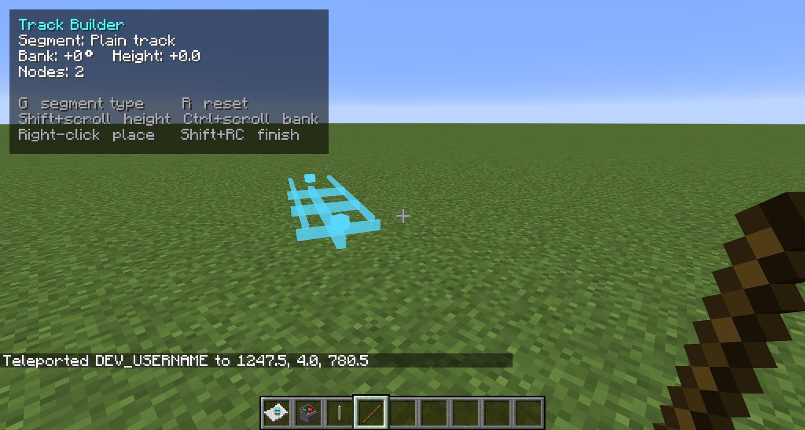
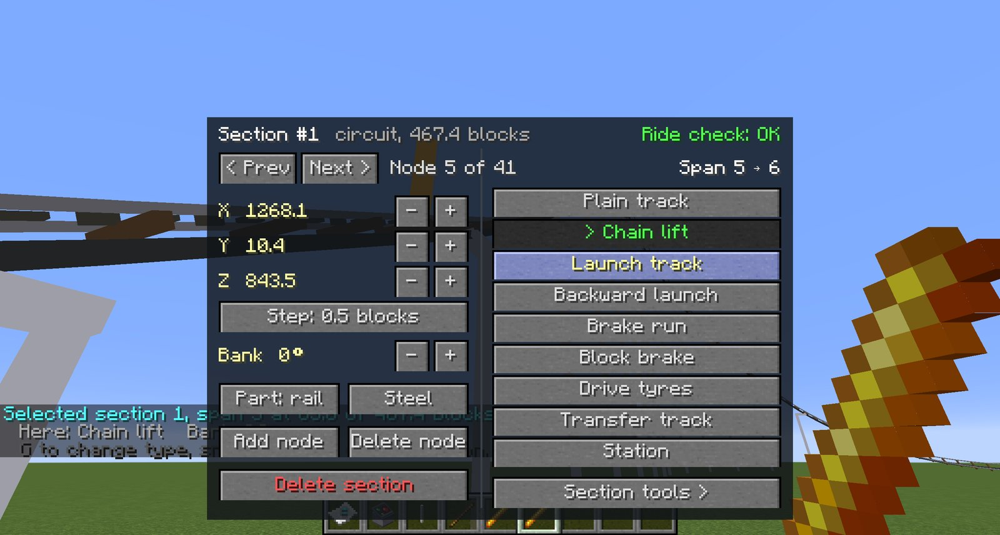
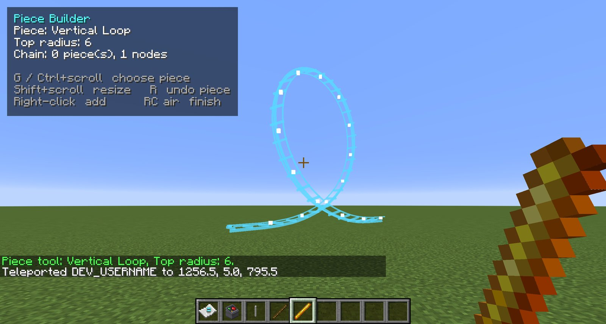

# Your first coaster

This guide takes you from an empty field to a working coaster you can ride: a station, a chain lift,
a drop, a turn and a brake run back into the station. It takes about ten minutes. If you have not
yet, [try the demo coaster](demos.md#the-demo-coaster) first: it is exactly this kind of ride, and
seeing one run makes every step here make sense.

## What you need

- A **creative world with cheats on**. A superflat world is easiest.
- From the **Rails & Coasters** creative tab: the **Track Builder** (`rcmc:track_tool`) and a stack of
  **Track Supports** (`rcmc:track_support`).
- Room: this coaster fits in about 80 × 50 blocks.

## How building works

You build a coaster by placing **nodes**, points the track passes through, and RCMC draws a smooth
curve through them. You don't lay track block by block.

- **Right-click a block** with the Track Builder to place a node **one block above** it.
- As you work, a **ghost** of the track so far is drawn in blue, and it shows how the next click
  would change it. Watch it: every node you add reshapes the curve on both sides of it.
- Each stretch of track between two nodes (a **span**) has a **type**: plain track, chain lift,
  station, brake run and so on. Press ++g++ to open the **segment picker** and choose the type
  **before** you place the node that ends the span.
- The **builder panel** at the top left shows the current type, the bank and height adjustment,
  how many nodes are placed, and how steep the next span would be.



!!! warning "Stay within reach of where you click"

    Right-clicking **air** finishes the track as it stands. A block too far away to reach counts as
    air, so a click at something out of reach finishes your coaster early. Walk (or fly) along with
    the track, and keep each click on a block within a few blocks of you. If it happens, `/rcmc undo`
    removes the section, and you start the run again.

Two more controls you'll use:

| Control | What it does |
| --- | --- |
| ++shift++ + scroll | Raise or lower the next node, half a block per notch |
| ++ctrl++ + scroll | Bank (tilt) the track at the next node, 5° per notch |
| ++r++ | Reset the height and bank adjustments |
| Sneak + right-click air | Undo the last node |

## Step 1 — The station

1. Stand at one end of where you want the platform, holding the Track Builder.
2. Press ++g++ and choose **Station**.
3. Right-click the ground at your feet to place the **first node**.
4. Walk **25 blocks** in a straight line and right-click the ground again for the **second node**.

That span is the station. A train is about 17 blocks long, so give it room. The platform and gates
are built for you when you finish the coaster.

## Step 2 — The chain lift

A lift needs something to reach up to. **Track Supports** stack into a column, and clicking the top
of a column puts a node exactly on top of it.

1. About **30 blocks** past the end of the station, carrying straight on, build a column of Track
   Supports **20 blocks tall** (place one, then keep placing against its top).
2. Press ++g++ and choose **Chain lift**.
3. Right-click the **top of the column**.

The lift runs from the end of the station up to the top of the column. If the builder panel flags
the climb as **too steep**, add a node partway up (on a shorter column) to ease it.

!!! tip "The lift decides everything"

    A coaster runs on the height its lift gives it. Nothing after the lift can be as high as the lift
    itself: friction and air take their share, so keep later hills well below it, about three-quarters
    of the lift's height at most.

## Step 3 — The drop and the turn

1. Press ++g++ and choose **Plain track**.
2. Carry on past the top of the lift, and place a node a few blocks **past and just below** the crest,
   to round it off.
3. Place the next node down **near the ground**, 15–20 blocks further on. That's the first drop.
4. Now turn round. Place three or four nodes in a wide arc, **at least 15 blocks across**, to bring the
   track back the way it came, alongside the lift. Keep nodes roughly 10–15 blocks apart.
5. To bank the turn, hold ++ctrl++ and scroll before placing each node in the arc. Tilt it inwards,
   20–30° for a turn like this.

Nodes too close together or too far apart make lumpy curves. Every 10–20 blocks is a good spacing,
closer on tight turns.

## Step 4 — Back to the station

1. Bring the track back parallel to the lift, heading for the start of the station. Add a small hill
   on the way if you like: a node a few blocks up, then back down. Keep it low.
2. About 25 blocks before the station, place a node, then press ++g++ and choose **Brake run**.
3. Right-click **the first node you placed**, the start of the station.

Clicking the first node **closes the circuit and finishes the coaster**. The last span, from your
last node into the station, is the brake run: it slows trains before they reach the platform.

## What you get

Chat reports what was built: the new section's **id**, its length, and the spans of each piece of
hardware. Then, automatically:

- **supports** are put up underneath the track, down to the ground;
- the station gets its **platform**, with a warning-striped edge and **air gates** where the train stops.

If the track has a problem in its shape, such as a kink or track passing through itself, chat says so.
It is built anyway, so you can see it and fix it.

## Step 5 — Ride it

```
/rcmc train <id> 5 0
```

Use the id from chat. A 5-car train appears in the station, and after a few seconds it dispatches
itself. Watch a lap first. Then wait for it to stop in the station, right-click a car to board, and
sneak to get off when you're back.

## Step 6 — Check it and fix it

```
/rcmc check <id>
```

This runs a lap and lists anywhere the ride is **too much**: too many G, a turn too tight for its
speed, or a spot where the train **can't get past**. Nothing is blocked, it's advice.

Better still, pick up the **Track Editor**. While you hold it, those same problems are **marked on the
track**, amber for over the limit and red for well over. Right-click the track near a problem to open
the editor screen on that node, and move it, bank it, or change its type. The marks update as you fix
things.



Common fixes:

| What you see | Fix |
| --- | --- |
| The train stops on a hill and stays there | The hill is too high for the speed. Lower it, or raise the lift |
| Too much G at the bottom of the drop | Make the bottom rounder: move the lowest node down less, or add a node to ease it |
| Too much sideways G in the turn | Bank the turn more, or make it wider |
| The train stops before the station | The brake run is too long, or its target too low: set it in the operator panel |

## Step 7 — Make it a ride

- Put a **Ride Operator Panel** by the station to open, close and dispatch it:
  [Operating a coaster](../guide/operating-a-coaster.md).
- Name it with `/rcmc ride <id> name <Name>` and put up a **Ride Sign** by the queue.
- `/rcmc rate <id>` gives its excitement, intensity and nausea ratings.

## Going further

- **Loops, corkscrews and other inversions** are easiest with the **Piece Builder**: pick a manoeuvre
  and click it onto the end of your track. You can start a run with the Track Builder and finish it
  with pieces, or the other way round.

    

- **Launches** instead of a lift, **block brakes** for more than one train, **storage tracks**, **shuttle
  coasters**: all in [Building a coaster](../guide/building-a-coaster.md).
